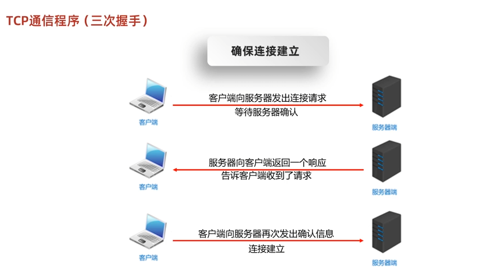
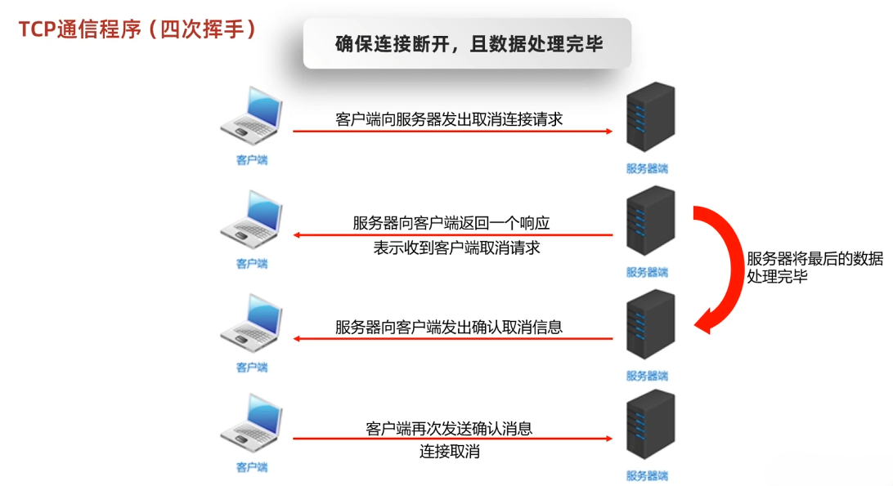

# 网络编程三要素

IP: 设备在网络中的地址

Port: 应用程序在网络中的唯一标识

Procotol: 传输规则，如 UDP, HTTP, FTP 等

## IP

上网设备在网络中的地址

IPv4 和 IPv6

### 特殊 IP
localhost: 127.0.0.1 本机的 IP

查看本机 IP 地址

```cmd
ipconfig
```

```powershell
Get-NetIPAddress
```

## Port

范围：0 ~ 65535

一个端口号只能被一个应用程序使用

## Procotol

OSI 参考模型

1. 应用层
2. 表示层
3. 会话层
4. 传输层
5. 网络层
6. 数据链路层
7. 物理层


TCP/IP 参考模型

1. 应用层 (HTTP, FTP)
2. 传输层 (TCP, UDP)
3. 网络层 (IP, ARP)
4. 物理链路层 硬件设备

### UDP
User Datagram Protocol
面向 **无连接** 通信协议，大小有限制，最多 64K

### TCP
Transmission Control Protocol
面向 **连接** 通信协议，无大小限制


### 三次握手和四次挥手



